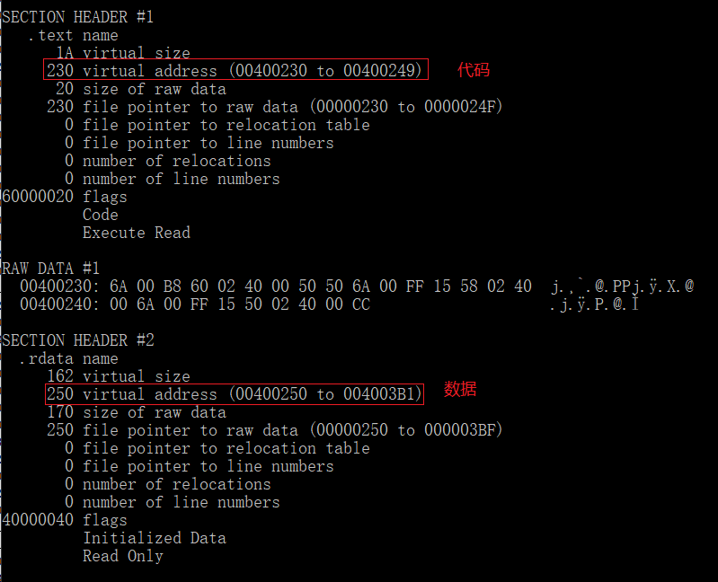
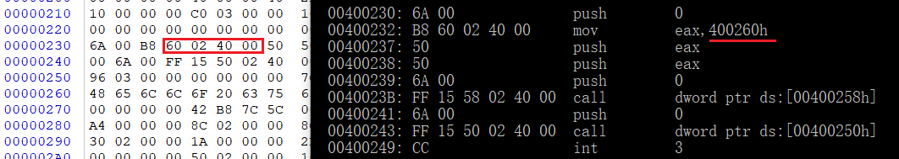
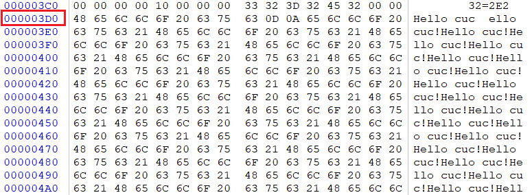
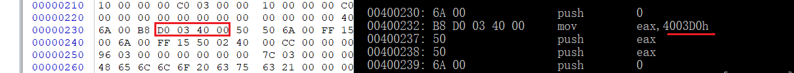
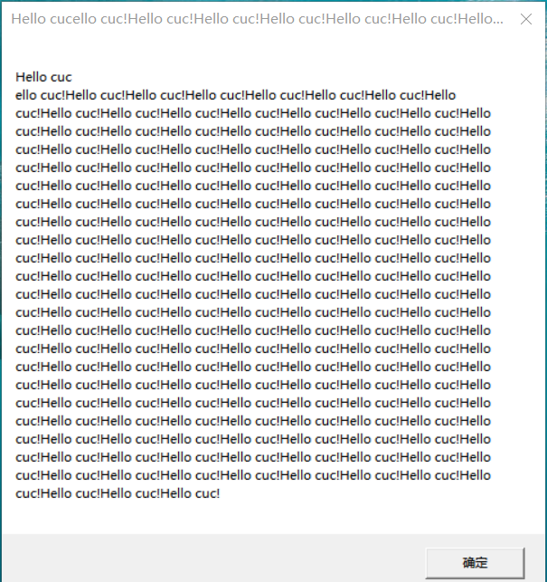

## 程序代码
        #include <Windows.h>
        int main(){
        MessageBoxA(NULL,"Hello world","Hello world",NULL);
        ExitProcess(0);
        }

## 过程

- 定位程序代码与数据在内存中的位置

    `dumpbin /all your.exe`

    

- 对程序进行反汇编

    `dumpbin /disasm your.exe`

    

    - `400260h`是打印参数的地址，在代码段中填入了这个地址，我们只需把代码段中的这个地址改成其他内容的地址即可

- 在程序尾部生成`>2kb`的内容，用其地址替换掉程序段中的`400260`
    - 生成内容

        

    - 替换地址
        

- 运行结果

    

