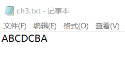
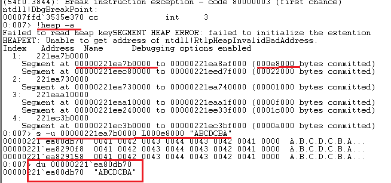
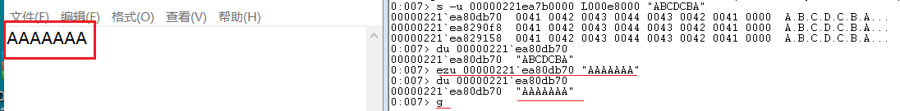

# 3、在notepad（32位64位均可）中，输入一段文字。然后使用调试器，在内存中修改这段文字。使得没有在界面操作notepad的修改文字的情况下。notepad中显示的文字变化。
提示，在调试器中定位控件缓存的内存地址，可以用搜索、逆向、消息截获分析、API截获分析等方法。


软件是数据和对数据的操作的集合。
软件安全就是研究软件的操作的具体过程、数据的具体形式，然后想办法获得、修改、破坏或者实施隐藏。又分为攻和防两个方面。
底层的软件，一次操作所能影响的数据少，操作的逻辑简单。
越到高层，一次操作所能影响的数据越多，操作的逻辑越复杂。
例如
指令 -> C语言语句 -> 函数 -> 对象
汇编 -> C -> C++ -> 各类脚本。
所以，我们进行软件攻防也有两种基本的方法。
hook 和 DKOM
hook，挂钩，即找到程序中的原有代码，并修改其代码，增加、减少或者篡改原用功能。达到授权破解（keygen）、作弊（游戏外挂）、隐藏（隐蔽攻击痕迹防止被防御软件查杀）等目的。
DKOM，直接内核对象操作。是一种典型的直接对程序内部数据的攻击

## 过程

- 打开记事本，输入任意内容

    

- 查找打印内容的内存

    ```
    #查看所有堆

    !heap -a  

    # 在堆中查找unicode字符串

    s -u 00000221ea7b0000 L000e8000 "ABCDCBA"

    # 显示内存内容

    du 00000221`ea80db70

    ```

    

- 对第一个内存中的内容进行修改

    ```
    # 向内存中写入unicode字符串
    
    ezu 00000221`ea80db70 "AAAAAAA"

    # 程序继续运行

    g
    ```

    

- 记事本显示发生变化