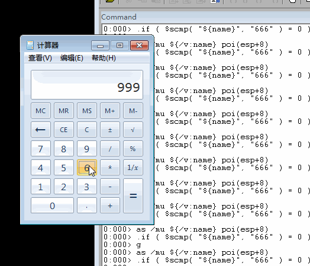

# 4 通过调试器监控计算器程序的运行，每当运行结果为666时，就改为999

## 实验工具
- win7虚拟机
- 计算器
- windbg

## 实验过程

1.  写一个脚本，内容如下

```
# 为poi(esp+8)这个地址中的内容命一个别名 name，相当于 #define name "666"
# /mu 别名等效于从地址开始的以null结尾的unicode字符串

as /mu ${/v:name} poi(esp+8)

# 通过字符串比较函数来判断(esp+8)这个指针指向的内容与"666"是否相等（相等函数返回0），相等的话将poi(esp+8)这个地址中的内容换成"999"

.if ($scmp("${name}","666")==0){ezu poi(esp+8) "999"} .else{}

# 继续运行
g

```

### 取别名原因
- `$scmp("string1","string2")`的参数只接受字符串字面量，如`$scmp("cuc","cuc")`，而不能是`$scmp(poi(esp+8),"cuc")`。

2. 在windbg输入`bp SetWindowTextW "$>+脚本目录"`


## 录屏



## 参考
[windbg脚本简单入门](https://bbs.pediy.com/thread-180879.htm)

[WinDBG conditional breakpoint with a unicode string](https://social.msdn.microsoft.com/Forums/en-US/f998bf93-026d-4803-a067-49f98dbc4e03/windbg-conditional-breakpoint-with-a-unicode-string?forum=windbg)