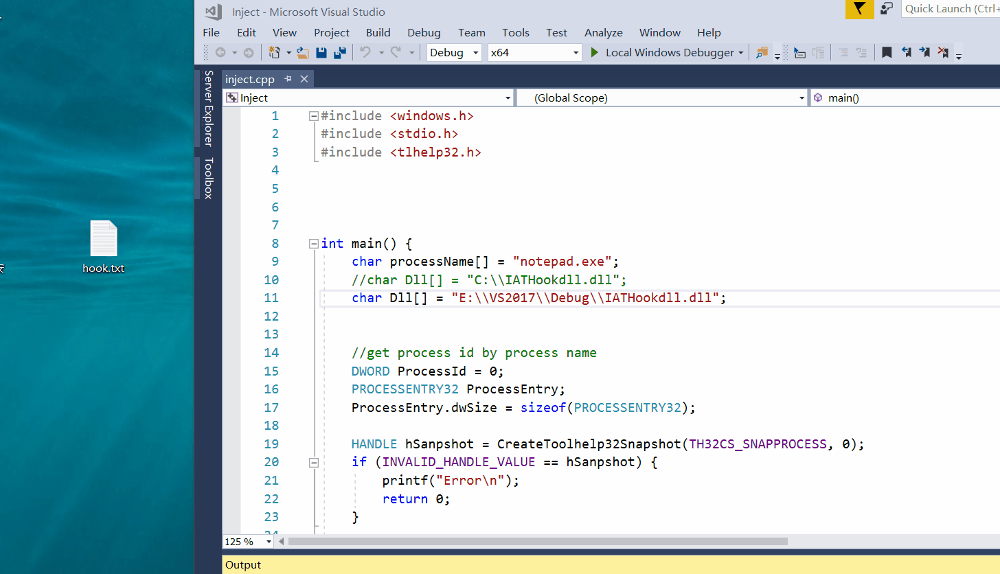

# 5、通过API hook的方法，在每次notepad保存txt文件时，就将文件内容修改为： “you have been hacked!”
API hook 的关键是编写一个假函数，用假函数的指针替换IAT中真函数的指针（当然这种方式只能对通过IAT调用的管用，但是够了。）在假函数调用真函数，修改真函数的参数和返回的数据，将修改后的数据返回给调用者。

## 实验环境
`win10 64位`

## 原理

通过写一个伪`WriteFile`函数，将要写入的内容换成`you have been hacked!`。通过远程线程注入的方法对系统`WriteFile`函数进行替换。

## 实现

`IATHook`代码 ：[IATHook.cpp](Hookmain.cpp)

注入代码 ：[Inject.cpp](inject.cpp)

## 结果
