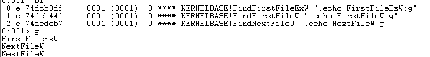
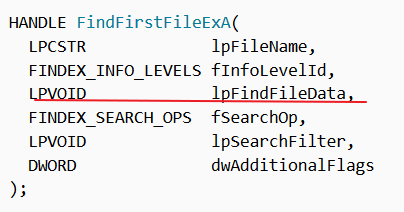
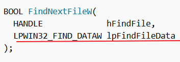
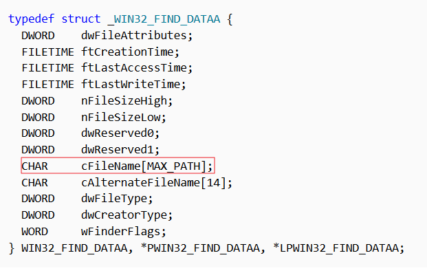
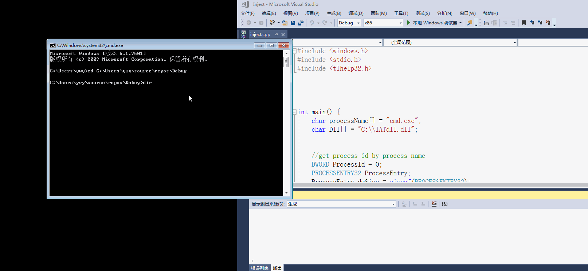

# 6、通过API hook的方法，使得cmd的dir命令看不到任意目录下的hacker.exe 
首先需要分析dir是通过什么API的调用来遍历目录的，然后hook相关函数。

## 实验环境
`win7 32位`
## 提前知道

1. ### 通过`cmd.exe`的导入表，发现涉及到与查找文件相关的三个函数，分别是：
- `FindFirstFileExW`
- `FindFirstFileW`
- `FindNextFileW`
2. ### 使用`windbg`对这三个函数下断点，查看具体使用的是哪些函数。其中`FindFirstFileW`函数在`dir`命令中并没有使用到

    

   - `FindFirstFileExW`，这个函数会返回一个搜索句柄供`FindNextFileW`使用，其中`lpFindFileData`中包含了该路径下第一个文件或目录的信息，其中就有文件名

   

   - `FindNextFileW`

   

   - `lpFindFileData`指向结构体的结构

   

## 思路
### 通过文件名比较，若当前的文件是我们想要隐藏的文件，则跳过此次查找，进行下一次查找，则此文件的信息会被隐藏。

## 实现
- `IATHook.dll`代码 ：[IAThook.dll](hmain.cpp) 

- 注入代码 ：[Inject.cpp](inject.cpp)

## 结果

