# 符号执行

## 静态符号执行

- 程序使用符号值而不是具体值作为输入，这些符号在符号执行过程中会不断变化，走向不同的执行路径，它们的路径约束就会不一样。下图程序中的三条路径对应的路径约束分别是 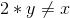、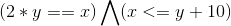、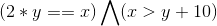，使用约束求解器对这些路径约束进行求解，就可以得到到达不同执行路径的输入。


    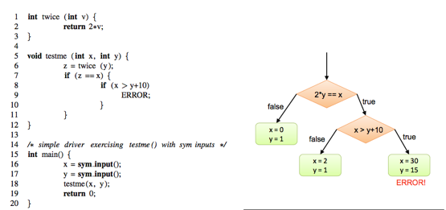

- 理论上符号执行能覆盖全部的程序执行路径，所以主要用来生成高覆盖率的测试用例，便于找到程序中的深层漏洞。


## 导向性执行(Concolic execution)

- Concolic执行维护一个实际状态和一个符号化状态：实际状态将所有变量映射到实际值，符号状态只映射那些有非实际值的变量。Concolic执行首先用一些给定的或者随机的输入来执行程序，收集执行过程中条件语句对输入的符号化约束，然后使用约束求解器去推理输入的变化，从而将下一次程序的执行导向另一条执行路径。

- 对于上面例子，若`x`，`y`初始值为`{x=22,y=7}`，会走到第7行的`else`分支，符号化执行会在实际执行路径生成路径约束 ，然后对约束取反，得到另一条执行路径的条件约束 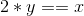，约束求解得到`{x=2,y=1}`，这个输入会走向路径约束为 ，将路径约束取反，走向 ，这样就探索到所有路径。


## klee

- klee是一个很好的符号执行工具，原理就是基于上面的`Concolic execution`，能为软件生成覆盖路径很高的测试用例，发现一些难以发现的漏洞。

### klee走迷宫


1.  从`docker hub`拉取`klee`镜像，以该镜像运行容器


2. 
```
maze.c

#include<string.h>
#include<stdio.h>
#include<stdlib.h>

#define H 7
#define W 11

char maze[H][W] = { "+-+---+---+",
                    "| |     |#|",
                    "| | --+ | |",
                    "| |   | | |",
                    "| +-- | | |",
                    "|     |   |",
                    "+-----+---+" };

void draw(){
    int i,j;
    for(i=0;i<H;i++){
        for(j=0;j<W;j++){
            printf("%c",maze[i][j]);
        }
        printf("\n");
    }
    printf("\n");
}

int main(){
    int x,y;
    int ox,oy;
    int i=0;
    #define ITERS 28
    char program[ITERS];

    x=1;
    y=1;
    maze[y][x]='X';

    printf ("Maze dimensions: %dx%d\n", W, H);
	printf ("Player pos: %dx%d\n", x, y);
	printf ("Iteration no. %d\n",i);
	printf ("The player moves with 'w', 's', 'a' and 'd'\n");
	printf ("Try to reach the price(#)!\n");

    draw();

    klee_make_symbolic(program,ITERS,"program");

    while(i<ITERS){
        ox=x;
        oy=y;

        switch(program[i]){
            case 'w':
                y--;
                break;
            case 's':
                y++;
                break;
            case 'a':
                x--;
                break;
            case 'd':
                x++;
                break;
            default:
                printf("Wrong command!(Only w,s,a,d!)\n");
                printf("You lose!\n");
                exit(-1);

        }

        if(maze[y][x]=='#'){
            printf("You win\n");
	        klee_assert(0);
            printf("solution is <%42s>\n",program);
            exit(1);
        }

        if (maze[y][x] != ' ' &&
			!((y == 2 && maze[y][x] == '|' && x > 0 && x < W)))
		{
			x = ox;
			y = oy;
		}

        printf ("Player pos: %dx%d\n", x, y);
		printf("Iteration no. %d. Action: %c. %s\n",i,program[i], ((ox==x && oy==y)?"Blocked!":""));


        if(x==ox&&y==oy){
            printf("you lose\n");
            exit(-2);
        }

        maze[y][x]='X';
        draw();
        i++;
        sleep(1);

        printf("you lose\n");


    }


}
```

- 编译
`clang -emit-llvm -c -g maze.c -o maze.bc`

- 运行
`klee –emit-all-errors maze.bc`

- `klee`生成了309个测试用例，其中4个测试用例能完成走迷宫

    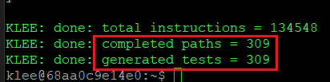

    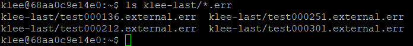

    - 其中一个测试用例为

    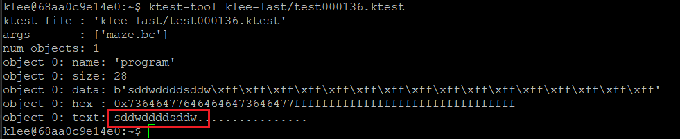

    - 以该用例为输入有

    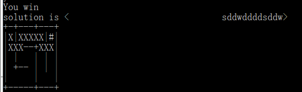

### 生成测试用例

1. 具体代码

```

#include<stdio.h>
#include<stdlib.h>

void foo(int x, int y, int z) {
	int a, b, c;
	a = b = c = 0;
	if (x > 0) {
		a = -2;
	}

	if (y < 5) {
		if (y + z > 0) {
			b = 1;
		}
		c = 2;
	}
    //希望到达的测试路径
	if (a + b + c == 3) {
		printf("hit it!\n");
		klee_assert(0);
	}
}

int main() {
	int x, y, z;
	klee_make_symbolic(&x, sizeof(x), "x");
	klee_make_symbolic(&y, sizeof(y), "y");
	klee_make_symbolic(&z, sizeof(z), "z");

	foo(x, y, z);
}

```

2. 执行树

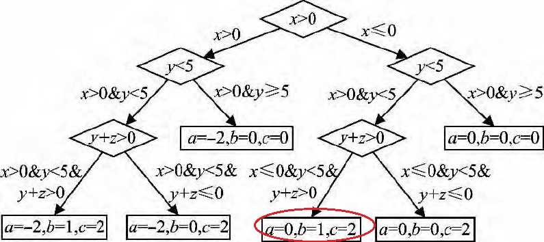

3. 一共生成了6个测试用例，符合执行树中的执行路径条数，且有一测试用例命中目标路径

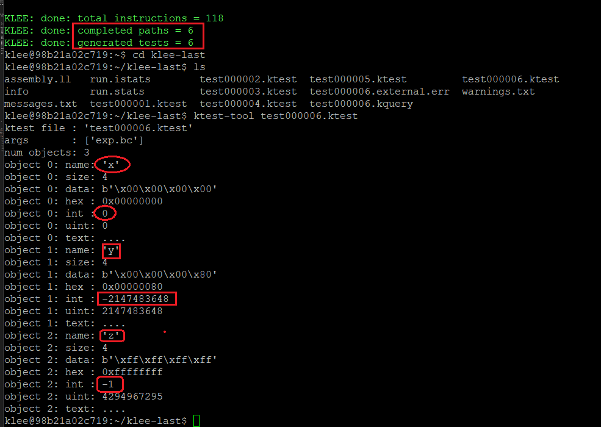

这个测试用例存在一个有趣的问题，在进行 `y+z` 计算时会发生溢出，`y=-2147483648` 是4字节的最小负数，`z=-1`，二者相加会溢出得到4字节最大正数 `2147483647` 这才满足 `y+z>0`这一约束。

4. 尝试控制测试用例值的生成范围，在`klee`得教程中有这样一个函数`klee_prefer_cex`，描述如下。

    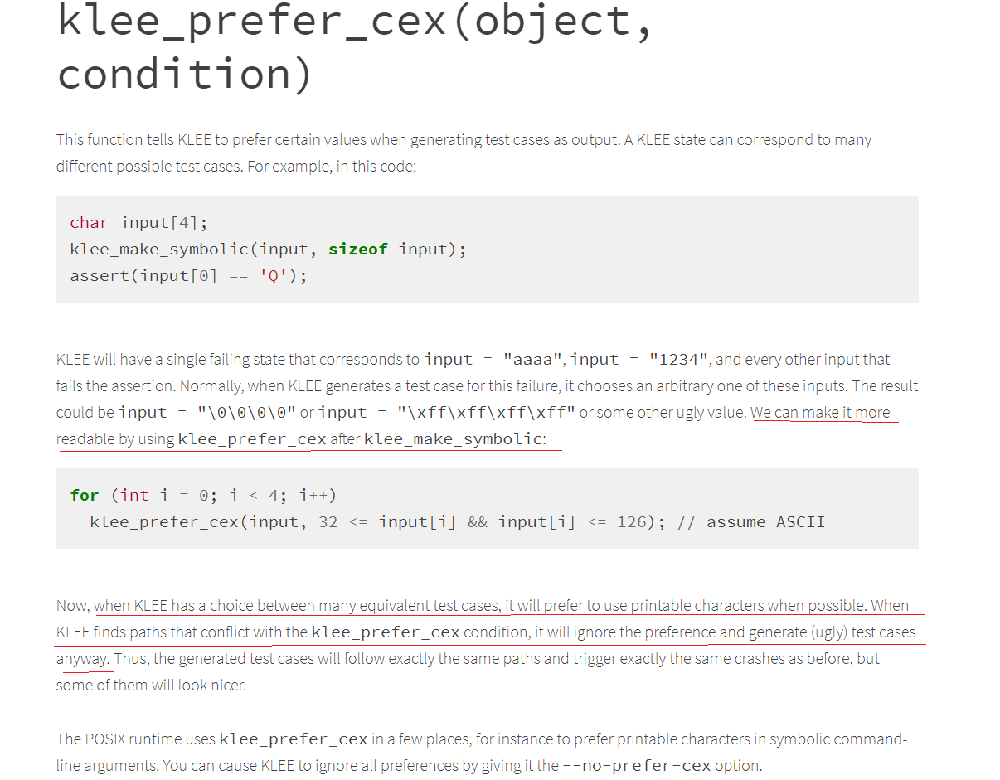

    我理解得意思是`klee`在生成测试用例是会优先考虑从给定范围内生成，在`main`函数中添加对`x`、`y`、`z`值得范围，在运行的时候会报很多错，现在还没有解决。


    ```
    int main() {
	int x, y, z;
	int max=1073741823;
	int min=-1073741824;
	klee_make_symbolic(&x, sizeof(x), "x");
	klee_make_symbolic(&y, sizeof(y), "y");
	klee_make_symbolic(&z, sizeof(z), "z");

	klee_prefer_cex(x,min<x&&x<max);
	klee_prefer_cex(y,min<y&&y<max);
	klee_prefer_cex(z,min<z&&z<max);

	foo(x, y, z);
    }
    ```

    

